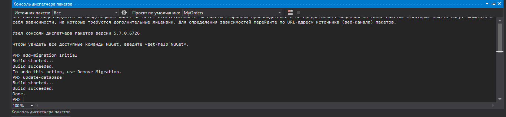

# My orders

Инструкция по запуску приложения:
Приложение можно запустить при наличии sql server, открыв файл MyOrders.sln в Visual Studio.
1. Необходимо открыть консоль менджера пакетов и обновить базу данных (написать в консоль update-database)

2. Запустить приложение из проекта в Visual Studio(Ctrl + F5).
